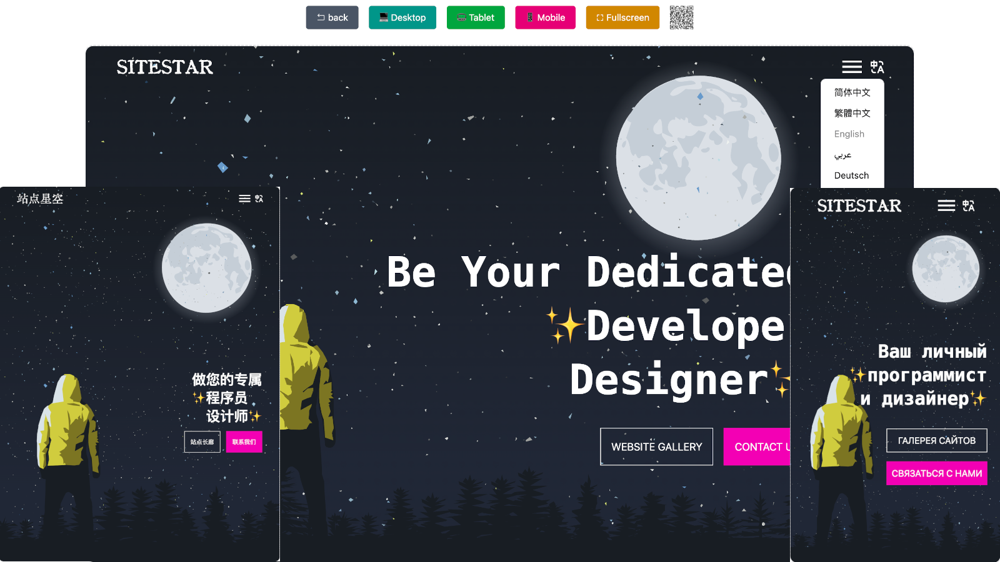

Astro Theme: 

Live Demo: https://sitestar.howduudu.tech



## **Features88**

* Built with Astro and Tailwind CSS
* SEO-friendly
* Responsive Design.
* Highly Customizable.
* Open Graph tags and dynamic OG image generation for social media sharing.
* Sitemap
* Analytics built-in
* Accessible out of the box
* Multi-language support based on i18n
* Customize text logo svg according to font
* Transition Animation
* Element animations and transition animations
* Freely switch between multiple device simulation displays

## TL;DR

```shell
npm create astro@latest -- --template pysunday/astro-sitestar
```

## Commands

Command | Action
------- | ------
`npm install` | Install dependencies
`npm run dev` | Start the development server at `http://localhost:4321`
`npm run build` | Build for production into `./dist/`
`npm run preview` | Preview the production build locally
`npm run auto-deploy-website` | Build and deploy to GitHub repository

## **License**

Astro Site Star is licensed under the MIT license — see the [LICENSE](./LICENSE.md) file for details.

## **Thanks**

Thanks to [codepen](https://codepen.io/yagoestevez/pen/oapQEJ) for providing the public idea.

**If it helps you, please give a thumbs up. The project address is:**


